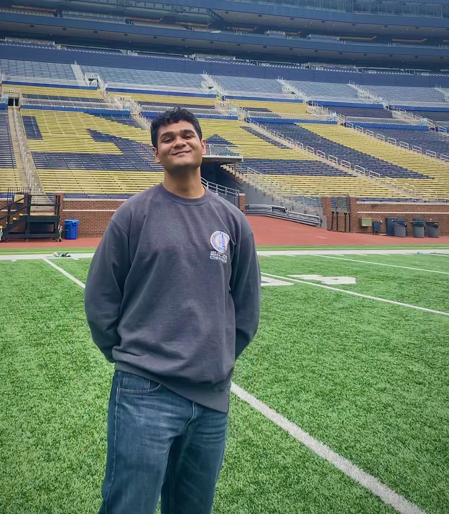

## About Me {#about-me}

I am an incoming MS/PhD student in Biostatistics at the UCLA Fielding School of Public Health. My current research interests lie in chronic disease epidemiology, precision health/biomarker discovery, and clinical trial design. 

I recently graduated from UC Berkeley (go bears!) with a BA in Public Health and a minor in Data Science. As an undergraduate, I led research at the UC Berkeley Disability Lab under the supervision of Professor Karen Nakamura. 

I conducted research under Professor Nikola Banovic at the University of Michigan within the 2022 Big Data Summer Institute. 

Recently, I conducted survival analysis and prognostic biomarker research under Professor Paul Boutros at UCLA within the Bruins-in-Genomics summer research experience. 

<!-- Insert your photo -->

&copy; 2023 Amaan | [GitHub](https://github.com/amaanjsattar)
